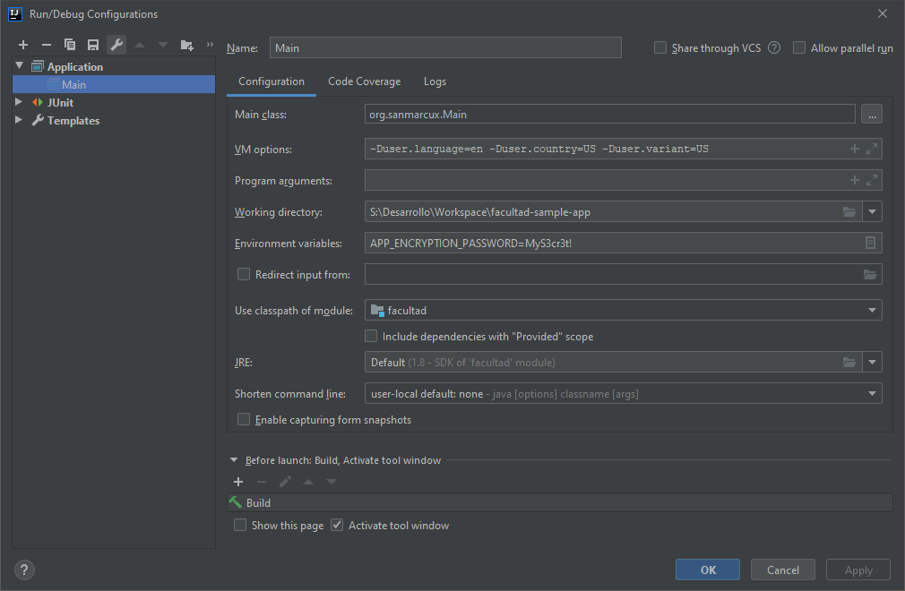

# Facultad Sample Application
[](https://travis-ci.org/cesardl/facultad-sample-app) [](https://sonarcloud.io/project/issues?id=org.sanmarcux.samples.mysql.facultad&resolved=false) [](https://sonarcloud.io/component_measures?id=org.sanmarcux.samples.mysql.facultad&metric=coverage) [](https://codeclimate.com/github/cesardl/facultad-sample-app/maintainability) [](https://codeclimate.com/github/cesardl/facultad-sample-app/test_coverage)

El siguiente es una aplicacion en el cual se ve el uso de las distintas query SQL para el SGBD MySQL.

## v 2.0.0
Ya con el pasar de los años me animé a hacer la actualización a Java 8 y utilizar Spring Framework. Además estoy considerando la creación de test unitarios que en su momento no hice.

## v 1.0.0
Esta aplicacion la hice cuando estaba en 3er año en la UNMSM, la estoy actualizando para que tenga funcionalidades de Java 7, otras librerias graficas y la implementacion de algunos patrones de diseño de software.

## Troubleshooting

Al realizar la configuraci&oacute;n en Travis tuve un problemilla ya que la clase `javax.swing.JDialog` necesita la variable X11 configurada para poder levantar su dependencia gr&aacute;fica.

Aqu&iacute; explican como simular un entorno gr&aacute;fico en Travis: 

- [GUI and Headless Browser Testing](https://docs.travis-ci.com/user/gui-and-headless-browsers/#Using-xvfb-directly)

## For usage

### Language activation

```
-Duser.language=es -Duser.country=PE -Duser.variant=PE
```

```
-Duser.language=en -Duser.country=US -Duser.variant=US
```

### Environment variable for password encryption

```
APP_ENCRYPTION_PASSWORD MyS3cr3t!
```

### Generating password

[Jasypt Online Encryption and Decryption(Free)](https://www.devglan.com/online-tools/jasypt-online-encryption-decryption)

### Example on IDE execution



### Schema configuration

Use _db_ directory

### Schema backup

```bash
mysqldump -u root -p facultad -r src/main/resources/db/facultad_schema_and_data.sql
```
